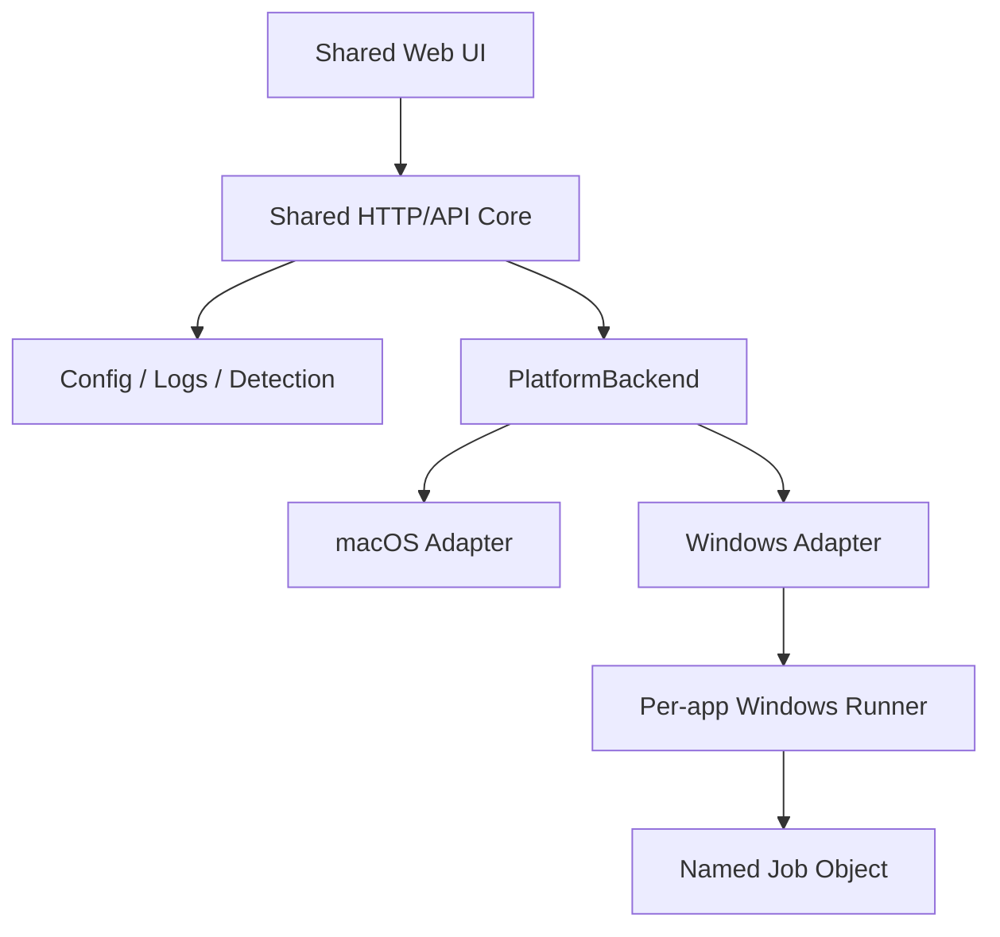

# Local Ops 原生 Windows 迁移开发 Spec

> 本文档用于直接交给 Codex 执行。它既是需求规格，也是工程约束、实施计划和验收协议。

## 0. 文档元信息

| 字段 | 内容 |
| --- | --- |
| 项目 | `laogou717/local-ops` |
| 上游仓库 | <https://github.com/laogou717/local-ops> |
| 审查基线 | `main` · `a5c3adae1f1fa0bd9f0ac7b090ec422e285d0c0f` |
| 当前形态 | macOS 本地运维控制台：Python 标准库后端 + 原生 HTML/CSS/JavaScript + `.app` 启动壳 |
| 目标形态 | 保留 macOS 能力，同时新增可原生运行、可测试、可打包的 Windows 10/11 x64 版本 |
| 目标质量 | Windows 功能对齐 Beta；安全属性不得低于现有 macOS 版本 |
| Spec 状态 | Proposed |

若执行时仓库 HEAD 已经晚于上述基线：

1. 不得强制 reset 或降级仓库；
2. 记录实际 HEAD；
3. 审查基线之后与平台、进程、安全、配置、发行相关的差异；
4. 将仍然适用的变更纳入方案，再开始实施。

---

## 1. 给 Codex 的总指令

你是本项目的主实现者。请在完整阅读 `AGENTS.md`、本 Spec、`README.md`、`SECURITY.md`、`RELEASE_CHECKLIST.md` 和相关测试后，分阶段完成原生 Windows 迁移。

执行原则：

1. 先冻结行为，再重构；先完成平台抽象，再实现 Windows。
2. 保留单一双平台代码库，不创建长期漂移的 Windows-only 复制工程。
3. 前端、HTTP API、配置领域逻辑和项目识别尽量复用，不改写为 Electron、Tauri 或其他桌面框架。
4. Windows 版本必须原生运行；WSL、Git Bash 或 Docker 只能作为可选兼容模式，不能冒充 Windows 原生实现。
5. 不得以按端口杀进程、`taskkill /T`、仅凭 PID、仅凭进程名或仅凭 cwd 的方式实现进程所有权。
6. 不得将 POSIX shell 命令静默翻译成 Windows 命令。
7. 不得为了读取进程信息而要求管理员权限。
8. 不得降低现有 loopback、Host、Origin、控制令牌、配置原子写和“不误杀外部进程”等安全边界。
9. 每个阶段必须先通过本阶段验收门槛，才能进入下一阶段。
10. 未实际运行的测试必须明确标记 `NOT_RUN`；环境不具备时不得声称通过。
11. 不得修改、覆盖或清理用户已有的无关工作树变更。
12. 未经用户明确授权，不执行 push、创建 PR、发布 Release、上传安装包或使用签名证书。

本 Spec 明确授权为 Windows 支持新增窄平台包，并允许 Windows runtime 使用 `psutil + pywin32`。这会改变现有 `AGENTS.md` 中“单文件、仅标准库、零运行时依赖”的约束；执行者必须同步更新 `AGENTS.md`、README、安装和发行说明，使约束与实际架构一致。除此之外，不得借机进行无关的全项目分层重写。

开始开发前先输出：

- 当前分支、HEAD、工作树状态；
- 发现的用户已有改动及避让策略；
- 实际执行计划；
- 当前运行环境是否具备 macOS、Windows 或仅 Linux/WSL 测试能力；
- 预计本轮能完成到哪个阶段。

---

## 2. 背景与现状

该项目不是 Swift/AppKit 原生应用。现有主体是：

```text
浏览器 UI
    ↓ HTTP/JSON
Python 本地服务
    ↓
macOS 进程、端口、文件系统和 AppleScript
```

可复用部分：

- `static/` 下绝大多数 HTML/CSS/JavaScript；
- HTTP 路由、配置领域逻辑、日志读取、项目类型识别；
- 现有 Host/Origin/控制 Cookie 等 Web 安全逻辑；
- 现有测试表达出的产品行为；
- 图标、主题、静态资源系统。

主要 macOS 耦合：

| 能力 | 当前实现 | Windows 问题 |
| --- | --- | --- |
| 单实例锁 | `fcntl.flock` | `fcntl` 为 Unix-only |
| 用户身份 | `os.getuid()` | Windows 使用 SID，不存在 POSIX UID 语义 |
| 监听端口 | `lsof -iTCP` | Windows 无内置 `lsof` |
| 进程快照 | macOS `ps` 参数格式 | Windows 命令、字段和权限语义不同 |
| cwd 获取 | `lsof -d cwd` | Windows 对外部进程 cwd 无可靠通用等价物 |
| 受管身份 | UID + PGID + argv token | Windows 没有等价 PGID |
| 启动命令 | `/bin/bash` + POSIX shell 文本 | cmd/PowerShell 引用规则不同 |
| 停止 | `SIGTERM` / `killpg` | Windows 无通用优雅 SIGTERM |
| 路径 | `~/Library/...` | 应使用 `%LOCALAPPDATA%` |
| 权限 | `chmod 0700/0600` | NTFS 需要 DACL/ACL |
| 文件选择 | `osascript` | 需要 Windows 原生文件对话框 |
| 启动壳 | `.app`、`start.command` | 需要 Windows launcher/EXE |
| 构建检查 | Bash、`plutil`、`iconutil` | Windows CI 不具备这些工具 |

---

## 3. 产品目标

### 3.1 必须实现

Windows 10 22H2 与 Windows 11 x64 普通用户能够：

1. 启动控制台且无需管理员权限；
2. 在浏览器中查看当前用户可访问的本地监听服务；
3. 查看进程 PID、端口、CPU、内存、运行时间、命令和可获得的项目路径；
4. 添加、编辑、删除服务与批处理任务；
5. 启动 Python、Node/npm/pnpm、`.cmd/.bat`、PowerShell、Go、Rust 等常见项目命令；
6. 安全停止或重启由控制台启动的进程树；
7. 关闭控制台后，让已启动的服务继续运行；
8. 重新打开控制台后，安全恢复对受管服务的识别；
9. 查看日志和任务退出状态；
10. 选择工作目录和脚本；
11. 从 macOS 配置进行显式、可预览、可回滚的导入；
12. 以源码方式运行，并能构建 self-contained Windows Beta 发行包；
13. 在 Windows CI 和真实 Windows 环境中通过规定测试。

### 3.2 成功定义

只有同时满足以下条件，才能宣布 `WINDOWS_BETA_READY=true`：

- macOS 现有测试保持通过；
- Windows 单元、集成和安全测试全部通过；
- 不存在按端口、裸 PID 或进程名误杀的路径；
- Windows 运行时不要求管理员权限；
- 控制台仍只监听 loopback；
- 配置、令牌和日志具有当前用户 ACL；
- 真实 Windows 10/11 非管理员账户完成 smoke test；
- self-contained `onedir` 包在未安装 Python 的干净 Windows 环境启动成功；
- 所有未完成或降级功能在 UI、README 和发行说明中明确披露。

### 3.3 非目标

本阶段不做：

- 公网或局域网远程控制；
- 多人协作、账户系统或云同步；
- Windows 服务模式；
- 自动提权或管理员模式；
- ARM64 正式发行；
- Electron/Tauri 重写；
- 自动转换任意 Bash/Zsh 命令；
- 在 Windows v1 中安全认领任意外部进程树；
- 自动迁移旧运行 PID、PGID、token 和日志；
- 自动发布或购买代码签名证书。

---

## 4. 不可破坏的系统不变量

以下不变量优先级高于功能对齐：

### INV-01：进程所有权不依赖端口

端口只是网络资源，不是进程所有权证明。任何停止、重启、强制结束操作都不得只依赖端口。

### INV-02：PID 不构成稳定身份

Windows PID 会复用。稳定身份至少必须包含：

```text
owner SID + PID + process create time + generation ID
+ run token + job identity
```

### INV-03：普通停止不得静默升级为强杀

普通停止超时后必须保留管理身份并向用户报告。只有明确的 Force 操作才能调用强制终止。

### INV-04：控制台停止不停止受管服务

关闭 HTTP 控制台不得自动结束已经启动的服务或任务。监督进程与控制台进程必须解耦。

### INV-05：身份不确定时不执行破坏性操作

当 SID、创建时间、token、Job、runner 或 IPC 校验不完整时，状态必须是 `unknown/orphaned/degraded`，停止操作必须 fail closed。

### INV-06：只控制当前 Windows 用户

不得启动、认领或结束其他用户 SID 的进程。对不可访问的系统进程进行跳过和降级展示，不得崩溃或提权。

### INV-07：本地 HTTP 不等于当前用户认证

Loopback 是整台机器级资源。状态、日志和写接口必须具有当前控制台实例的不可猜测认证能力，不能因为请求来自 `127.0.0.1` 就直接授权。

### INV-08：配置写入可恢复

配置更新必须保留上一份良好备份，使用临时文件和原子替换；失败时不得以空配置覆盖主配置或备份。

### INV-09：跨平台命令不自动猜测

来自 macOS 的 POSIX shell 文本在 Windows 上默认标记为 `needs_review`。不得通过字符串替换生成“看起来能跑”的 Windows 命令。

### INV-10：macOS 行为保持

平台抽象完成后，现有 macOS API、配置和核心 UI 行为不得无意改变；所有变化必须有测试和变更说明。

---

## 5. 目标架构



### 5.1 建议目录

本次只抽取操作系统边界，不顺带重写 HTTP Handler、Config、诊断系统或前端模块。允许在不改变职责边界的前提下微调文件名，但不得把所有平台分支继续堆入单个 `server.py`。

```text
localops/
├── __init__.py
├── platform/
│   ├── contracts.py
│   ├── loader.py
│   ├── macos.py
│   └── windows.py
├── command_spec.py
└── windows/
    ├── runner.py
    └── job_object.py
server.py                  # 保留 HTTP、配置、业务编排和兼容入口
static/
tools/
├── build_windows.py
└── check_platform_leaks.py
tests/
├── contract/
├── windows/
└── integration/
```

禁止借平台迁移把 `server.py` 一次性拆成通用的 controllers/services/repositories 架构。平台抽取是本任务唯一允许的结构性重组。

### 5.2 PlatformBackend 契约

平台接口至少覆盖：

```python
class PlatformBackend(Protocol):
    name: str

    def runtime_paths(self) -> RuntimePaths: ...
    def current_principal(self) -> Principal: ...
    def acquire_instance_lock(self, identity: str) -> InstanceLock | None: ...
    def scan_listeners(self) -> ListenerSnapshot: ...
    def process_snapshot(self, pids: set[int] | None = None) -> ProcessSnapshot: ...
    def process_cwds(self, pids: set[int]) -> dict[int, str | None]: ...
    def launch(self, app: AppConfig) -> ManagedRuntime: ...
    def inspect_managed(self, identity: RuntimeIdentity) -> ManagedInspection: ...
    def stop_managed(self, identity: RuntimeIdentity, force: bool) -> StopResult: ...
    def pick_path(self, kind: Literal["dir", "script"]) -> PickResult: ...
    def open_browser(self, url: str) -> None: ...
    def restart_console(self, preferred_port: int) -> RestartResult: ...
```

要求：

- 业务层不得直接 import `fcntl`、`win32api`、`psutil` 或调用 `ps/lsof/osascript`；
- 平台扫描必须返回“成功 / 部分成功 / 失败”状态，不能用空集合掩盖命令不存在或权限错误；
- 破坏性操作必须使用强类型身份对象，而不是裸 PID；
- `macos.py` 首先搬运现有实现，确保行为零变化；
- Windows-only 依赖使用环境标记或独立 requirements，不得破坏 macOS 安装。
- “受管进程停止”和“外部进程结束”必须是不同契约，禁止共享一个接受裸 PID 的通用 kill 接口。

---

## 6. Windows 技术决策

### 6.1 依赖

Windows 运行时允许新增：

- `psutil`：进程、端口、CPU、内存、命令行、创建时间等；
- `pywin32`：SID、DACL、Named Mutex、Named Pipe、Job Object、进程创建和 Windows 对话框；
- Python 标准库：HTTP、配置、日志、线程、序列化。

构建期允许：

- `PyInstaller`：首版使用 `onedir + windowed`；
- 现有资源生成依赖。

要求：

- 记录并锁定实际验证过的依赖版本；
- 不以每 2 秒启动 PowerShell、WMI/CIM 或 `netstat` 子进程作为生产监控方案；
- 不手写大段 Win32 `ctypes` 重造 `pywin32/psutil` 已稳定提供的能力；
- 依赖加载失败时提供明确诊断，不得静默显示“没有进程”。

### 6.2 Windows 默认路径

```text
%LOCALAPPDATA%\LocalOps\config.json
%LOCALAPPDATA%\LocalOps\config.json.bak
%LOCALAPPDATA%\LocalOps\icons\
%LOCALAPPDATA%\LocalOps\logs\
%LOCALAPPDATA%\LocalOps\runtime\
```

可使用 Windows Known Folder API 解析 Local AppData。不得把运行数据写入程序目录或 `Program Files`。

### 6.3 ACL

配置、日志、控制令牌、runner 状态和 IPC 对象必须：

- 所有者为当前用户 SID；
- 当前用户拥有所需读写权限；
- 不向普通其他用户开放；
- 按设计允许 SYSTEM/Administrators，且在文档中说明；
- 启动时验证关键 ACL，验证失败则进入降级或只读保护状态。

不得把 `chmod 0600/0700` 作为 Windows 安全证明。

### 6.4 路径防护

自定义数据目录至少拒绝：

- 盘符根目录，如 `C:\`、`D:\`；
- 用户主目录本身；
- 项目根目录本身；
- UNC 根和共享根；
- 指向过宽目标的 junction/reparse point；
- 通过大小写、短文件名、规范化差异绕过的等价路径。

比较路径时使用 Windows 规范化与大小写折叠，覆盖中文、空格、OneDrive、D 盘和长路径测试。

---

## 7. Windows 受管进程模型

这是本迁移的最高风险模块，必须单独实现和测试。

### 7.1 运行身份

建议配置 schema v2 使用 tagged union：

```json
{
  "runtimeIdentity": {
    "platform": "windows",
    "kind": "job",
    "ownerSid": "S-1-5-21-...",
    "generationId": "0195...",
    "runnerPid": 1234,
    "runnerCreateTime": 1780000000.123,
    "rootPid": 5678,
    "rootCreateTime": 1780000001.456,
    "jobName": "LocalOps-<app-id>-<token-digest>",
    "tokenDigest": "sha256:...",
    "startedAt": 1780000001456
  }
}
```

不得将裸控制 token 返回前端、放入用户命令行参数、写入普通日志或显示在诊断页面。若重连需要 secret，保存在当前用户 ACL 保护的 runtime 文件中，配置只存摘要和非敏感身份信息。

### 7.2 启动流程

1. 完成 cwd、命令、脚本、运行时和日志目录预检；
2. 生成新的 generation ID 和至少 192 bit 随机 run token；
3. 启动独立 `windows_runner`；
4. runner 创建具当前用户 DACL 的 Named Job Object 和控制 IPC；
5. 以 suspended 状态创建目标根进程；
6. 将目标加入 Job Object；
7. 设置必要的进程组/控制台创建标志；
8. 以 `starting` 状态原子持久化完整 runtime identity；
9. 只有 Job 分配和身份持久化均成功后，才恢复目标进程；
10. 确认启动结果后，以 generation compare-and-swap 更新为 `running`；
11. runner 持有 Job/IPC 生命周期，控制台退出后 runner 继续工作；
12. runner 作为 Job 的独立句柄持有者，并使用等价于 `JOB_OBJECT_LIMIT_KILL_ON_JOB_CLOSE` 的明确关闭策略：控制台退出不会关闭 Job；runner 异常退出时终止其 Job，避免留下无所有者进程，并将这一可用性取舍写入文档；
13. 任何中间步骤失败都要清理本次创建的资源；Job 分配或身份持久化失败时，必须在恢复线程前结束 suspended 进程，用户命令不得获得执行机会。

runner 不得与 HTTP 控制台并发写主 `config.json`。runner 只写 ACL 保护、带 generation 的 runtime receipt；主控制台验证 receipt 后，以 compare-and-swap 更新配置。

不得依靠 `psutil.children(recursive=True)` 作为所有权证明；它可用于展示或辅助诊断，但不能替代 Job Object。

### 7.3 重连流程

控制台重启后：

1. 读取 ACL 保护的 runtime identity；
2. 校验当前 SID；
3. 校验 runner PID 和创建时间，防止 PID 复用；
4. 通过受保护 IPC 完成 challenge/response 或等价 token 校验；
5. 校验 generation 和 Job 成员状态；
6. 成功后恢复 `running`；
7. 校验不完整则标记 `orphaned/unknown`，禁止停止和重启，提供诊断而不是猜测恢复。

### 7.4 停止流程

普通停止：

1. 重新校验 SID、runner 创建时间、generation、token/IPC 和 Job 身份；
2. 由 runner 尝试适合目标的优雅停止协议；
3. 对兼容的 console 应用可尝试 `CTRL_BREAK_EVENT`；
4. 在限定时间内等待目标退出；
5. 超时后返回失败并保留 runtime identity；
6. 不得自动升级为强杀。

强制停止：

1. 必须来自明确的 Force UI/API 操作；
2. 重复执行全部身份校验和 generation compare-and-swap；
3. 通过 Job Object 终止受管成员；
4. 确认目标消失后再清除 runtime identity；
5. 记录结构化退出原因，但不记录 secret。

特别禁止：

- `taskkill /PID ... /T /F` 作为核心实现；
- 仅凭端口执行停止；
- 仅凭 PID 调用 `TerminateProcess`；
- 在 Windows 复用 `os.kill(pid, 0)` 做存活探测；
- 把 Windows `SIGTERM` 当成 Unix 优雅终止；
- 停止失败后清空 token，让活进程失去管理身份。

所有 start/stop/restart/delete 操作都必须携带预期 generation；延迟到达的旧请求不得影响新一代实例。

### 7.5 外部进程认领

Windows Beta 第一版：

- 外部监听进程可展示；
- 可以创建未认领的启动卡片；
- 禁止把外部进程声明为完整受管进程树；
- “认领并停止”功能在 Windows 上隐藏或明确标为不支持。

后续若实现，必须另立 Spec，并至少校验 SID、PID、创建时间、端口、exe 路径和可验证身份；无法读取 cwd 时不得猜测。

---

## 8. 命令模型与脚本兼容

### 8.1 Schema

新增 `commandSpec`，逐步替代不带语义的 shell 字符串。为保持 API/配置向后兼容，schema v2 继续保留原 `command` 字段用于显示、回退和旧 macOS 行为，不得在同一次迁移中强制删除：

```json
{
  "command": "python3 -m http.server 8000",
  "commandSpec": {
    "version": 1,
    "mode": "direct",
    "executable": "python.exe",
    "args": ["-m", "http.server", "8000"],
    "shell": null,
    "text": null,
    "needsReview": false
  }
}
```

允许的 mode：

| mode | 用途 |
| --- | --- |
| `direct` | 结构化 executable + args，首选 |
| `cmd` | 明确需要 `cmd.exe` 的 `.cmd/.bat` 或用户命令 |
| `powershell` | 明确的 PowerShell 命令或 `.ps1` |
| `legacy-posix` | macOS/Linux 旧命令；Windows 默认不可运行，除非用户显式配置兼容运行时 |

### 8.2 Windows 执行规则

- `direct`：不经过 shell；
- `cmd`：固定使用 `%COMSPEC% /d /s /c`，禁止 AutoRun 影响；
- `powershell`：固定使用 `-NoLogo -NoProfile -NonInteractive`；
- `.ps1` 不得默认添加绕过执行策略参数；
- `.cmd/.bat` 使用 cmd；
- `.exe/.com` 直接执行；
- `.py` 优先使用当前受支持 Python 解释器或明确配置的 launcher；
- `.sh/.zsh/.command` 在 Windows 默认 `needsReview=true`；
- 命令展示与实际 argv 必须分离，避免把展示字符串重新解析执行。

### 8.3 项目识别扩展

保留现有 Node/Python/Go/Rust/Docker 等识别，同时增加：

- `start.cmd`、`dev.cmd`、`run.cmd`；
- `start.bat`、`dev.bat`、`run.bat`；
- `start.ps1`、`dev.ps1`、`run.ps1`；
- Windows `PATHEXT` 和可执行文件发现；
- `npm.cmd`、`pnpm.cmd` 等 Windows shim；
- Python `py -3.12`/已打包解释器/配置解释器的明确选择。

任何自动识别结果都只是候选，保存前必须展示 mode、cwd、executable/args 或 shell text，以及端口。

### 8.4 注入测试

至少覆盖文件名和参数中的：

```text
空格 中文 & | < > ^ ( ) % ! ' " ` $ ;
```

结构化 executable/args 必须保持字面值；cmd 和 PowerShell 必须分别使用各自正确的引用规则，禁止复用 POSIX `shlex.quote`。

---

## 9. 配置 Schema v2 与导入

### 9.1 v2 目标

```json
{
  "schemaVersion": 2,
  "apps": [
    {
      "id": "deadbeef",
      "name": "Example",
      "kind": "service",
      "cwd": "C:\\Projects\\example",
      "port": 3000,
      "command": "python3 -m http.server 8000",
      "commandSpec": {},
      "runtimeIdentity": null,
      "importStatus": "ready"
    }
  ]
}
```

迁移函数必须：

- 显式、逐版本、幂等；
- 对未来更高 schema 保持只读保护；
- 有 N-1 升级测试；
- 不在 schema 迁移中启动命令或访问网络；
- 保留 `.bak` 恢复语义。

HTTP API 采用增量兼容：保留既有字段和 `{ok:false,error:"..."}` 基本结构，只增加 `platform`、`capabilities`、`commandSpec`、`platformCompatibility` 和稳定错误 `code`。不得借迁移机会重命名全部接口或重做错误协议。

### 9.2 macOS 配置导入

导入必须由用户显式发起，不自动扫描、不自动覆盖。

保留：

- app id、名称、类型和端口；
- 图标、主题、排序等纯 UI 配置；
- 可安全解释的平台无关元数据。

清空：

- `lastPid`、`lastPgid`、`runToken`、`attached`；
- 所有旧 `runtimeIdentity`；
- 依赖旧进程 key 的 hidden/pinned/promoted 数据；
- 旧任务的运行中状态。

不自动迁移：

- 日志；
- macOS 绝对路径；
- POSIX shell 命令；
- 运行时身份。

导入流程：

1. 解析并验证源配置；
2. 对源文件计算 hash 并创建只读备份记录；
3. 生成预览，不落盘；
4. 用户提供 macOS 根路径到 Windows 根路径的映射；
5. 每个 cwd 单独验证；
6. 每个 commandSpec 标记 `ready/needs_review/blocked`；
7. 目标已有配置时只允许选择性合并；
8. staged 写入临时目标；
9. 完整验证后原子落位；
10. 重复导入同一来源保持幂等；
11. 提供回滚到导入前备份的方法。

---

## 10. 本地 HTTP 与单实例安全

### 10.1 绑定

- 默认且不可配置地绑定 `127.0.0.1`；
- 不绑定 `0.0.0.0`；
- 不自动创建防火墙规则；
- Windows 使用独占地址语义，不照搬 `allow_reuse_address=True`；
- 端口 9600–9609 的回退策略可以保留；
- 端口绑定失败必须返回明确诊断。

### 10.2 认证

现有 Host、Origin、Sec-Fetch 和 HttpOnly Cookie 防护继续保留并加强：

- 所有包含配置、命令、路径、进程、日志的 `/api/*` 端点都要求控制会话；
- 写接口继续要求精确 same-origin；
- CLI 使用 ACL 保护文件中的 bearer capability；
- 浏览器使用一次性 bootstrap nonce 建立 HttpOnly Cookie，nonce 使用后立即失效；
- secret 不出现在日志、状态 API、错误响应或持久浏览器 URL；
- 禁止 CORS；
- 错误 Host、Origin、Cookie/token、Content-Type 必须 fail closed。

### 10.3 单实例

Windows 使用带当前 SID 和数据目录哈希的 Named Mutex 或等价 Win32 锁。

要求：

- 相同数据目录同一时刻只能有一个配置写者；
- 锁属于当前用户安全边界；
- 崩溃后可恢复；
- 已运行实例应被安全打开，而不是启动第二个写者；
- 不得只依靠“端口已占用”判断单实例。

---

## 11. 前端改造

前端保持原生 HTML/CSS/ES Modules，不引入构建框架。

必须修改：

1. 删除浏览器端 POSIX shell quote 和脚本命令生成，完全使用后端返回的 `commandSpec`；
2. 不再使用 `split('/')`、`lastIndexOf('/')` 解析绝对路径；
3. `/api/pick` 返回 `path/dir/stem/commandSpec` 等结构化字段；
4. 根据后端 `platform` 显示 `Ctrl+K/Ctrl+J` 或 macOS `⌘K/⌘J`；
5. 在 Edge 实测浏览器保留快捷键，冲突时改用不会被浏览器吞掉的组合；
6. 数据目录、日志目录、停止说明、启动方式等文案由后端能力返回，不硬编码 `.app` 或 `~/Library`；
7. Windows 不支持的外部认领操作必须隐藏或显示清晰说明；
8. 增加 `Segoe UI Variable`/`Segoe UI` 字体回退；
9. 保持深浅色、窄屏、键盘导航、`forced-colors` 和 reduced-motion 行为；
10. 所有 Windows 路径在 UI 中安全转义并可复制，不泄露 token。

---

## 12. 启动、打包与发行

### 12.1 源码运行

首先交付可诊断的源码运行方式：

- `start-windows.cmd` 或等价开发启动器；
- 检查 Windows、Python 版本和 Windows runtime dependencies；
- 失败时给出可执行的诊断；
- 不静默闪退；
- 开发启动器不得被描述为独立安装包。

### 12.2 Beta 发行包

首版采用：

```text
PyInstaller onedir + windowed + x64 zip
```

要求：

- 目标机器无需预装 Python；
- EXE 和静态资源完整；
- `tools/build_release.py`、项目检查器和显式发行 allowlist 已包含新增 `localops/` 包、Windows runner 与所需资源，防止开发目录可运行但最终 ZIP 缺代码；
- 程序目录只读时仍能运行；
- 用户数据全部写入 Local AppData；
- 包名包含版本和平台；
- 发行包不包含配置、日志、token、绝对路径、缓存或开发凭证；
- 提供 SHA-256；
- 未签名构建必须清晰标记 `UNSIGNED DEVELOPMENT BUILD`。

### 12.3 图标与素材

- Windows `.ico` 需要包含适当的多尺寸资源，包括 256px；
- 将通用 Web/ICO 生成与 macOS `iconutil`/ICNS 生成拆开；
- 新增 `.ico`、安装器图片或 tiles 后更新 `ASSET_PROVENANCE.md` 和 `THIRD_PARTY_NOTICES.md`；
- 原 MIT、ISC、OFL 声明必须保留；
- 现有 `REVIEW_REQUIRED` 素材在公开发布前必须补齐权利证据或替换；
- 自动测试通过不代表素材已经完成权利清理。

### 12.4 签名

开发阶段不要求真实签名证书。公开发行前另设 Release Gate：

- Authenticode SHA-256 签名；
- RFC3161 时间戳；
- `signtool verify /pa /v` 通过；
- 证书只在受保护的 tag/release job 使用；
- 签名后重新计算发行物 hash；
- 未获证书和用户授权时不得伪造“已签名”。

---

## 13. 分阶段开发任务

## Phase 0：基线冻结与风险登记

### 任务

- 阅读项目文档和全部测试；
- 记录实际 HEAD 和工作树状态；
- 运行当前环境可运行的权威测试；
- 保存 API/state/config 的行为基线；
- 将 macOS-only 调用分类；
- 建立 Windows 迁移状态文档。

### 交付物

```text
docs/windows-port/STATE.json
docs/windows-port/STATUS.md
docs/windows-port/DECISIONS.md
docs/windows-port/TEST-EVIDENCE.md
```

### 验收

- 当前测试结果、数量和失败原因有完整记录；
- 没有改动业务代码；
- 用户已有工作树改动没有被覆盖；
- 平台耦合清单完整；
- 实际环境能力明确。

## Phase 1：抽取平台层，保持 macOS 零回归

### 任务

- 建立 `PlatformBackend`；
- 将路径、锁、进程、端口、cwd、启动、停止、选择器、浏览器和重启能力迁出核心；
- 将原实现封装进 macOS adapter；
- 保留 `server.py` 兼容入口；
- 建立 fake platform 供单元测试使用；
- 为扫描失败增加 degraded 状态，不再用空结果吞错。

### 验收

- macOS 现有测试全部保持通过；
- HTTP/API golden 无意外差异；
- 核心层不再直接 import/call macOS 专属能力；
- fake platform 可测试成功、权限拒绝、超时和部分快照；
- 不包含 Windows 功能伪实现。

## Phase 2：Windows 存储、锁与只读监控

### 任务

- Windows adapter 可导入；
- 实现 Local AppData 路径和 DACL；
- 实现 Named Mutex 单实例；
- 用 psutil/Win32 获取端口和进程快照；
- 处理 AccessDenied、NoSuchProcess、IPv4/IPv6 和快照竞态；
- 实现 Windows 原生路径选择；
- 禁用外部认领和破坏性控制；
- 新增 Windows CI import/syntax/unit job。

### 验收

- 普通用户可启动只读 Windows 控制台；
- 可查看当前用户可访问的本地监听服务；
- 受保护系统进程不会让 `/api/state` 崩溃；
- 扫描失败显示 degraded，而不是假装空机器；
- 同一数据目录不能出现两个写者；
- ACL、盘符根、UNC、junction 测试通过；
- 本阶段所有进程结束功能保持禁用。

## Phase 3：命令、Schema、路径与兼容 UI

### 任务

- 引入 schema v2 和 `commandSpec/runtimeIdentity`；
- 保留旧 `command`/API 字段并实现增量兼容；
- 实现 cmd/PowerShell/direct 命令构造与静态预检；
- 扩展 Windows 项目识别；
- 实现显式 macOS 配置导入预览和路径映射；
- 修改前端路径、快捷键和平台文案；
- 完成 Windows 文件选择器契约；
- 本阶段受管进程启动/停止继续禁用。

### 验收

- v1→v2 迁移幂等；
- future schema 进入只读保护；
- macOS 导入不覆盖目标，运行身份全部清空；
- POSIX 命令被标记需复核，不静默转换；
- 中文、空格、D 盘和特殊字符命令测试通过；
- 前后端增量契约测试通过；
- macOS UI 和 API 无回归；
- Windows 生命周期按钮仍不可触发未实现控制路径。

## Phase 4：Windows runner、安全生命周期与完整 UI 流程

### 任务

- 实现 runner、Job Object、ACL IPC 和 runtime identity；
- 使用 Phase 3 的 commandSpec 实现结构化启动；
- 实现 generation compare-and-swap；
- 实现控制台关闭后 runner/服务继续；
- 实现控制台重启后的严格重连；
- 实现普通停止和显式 Force；
- 实现日志与 Windows 退出状态映射；
- 对启动失败和中间失败进行事务清理；
- 完成添加—启动—日志—诊断—停止—重启 UI 流程；
- 完成通知与平台能力降级文案；
- 更新 README/SECURITY/CHANGELOG。

### 验收

- Python/Node 测试服务能够启动、识别、停止和重启；
- 父脚本退出但后台子进程仍被 Job 正确管理；
- 控制台停止后服务继续运行；
- 控制台重开后能验证身份并恢复；
- PID 复用、同名、同端口、同 cwd 均不能骗过身份校验；
- 旧 generation 请求不能影响新实例；
- 普通停止超时不清身份、不自动强杀；
- Force 只终止已验证 Job；
- runner/IPC/token 校验失败时 fail closed；
- 不使用 `taskkill /T` 和 `os.kill(pid, 0)`；
- Edge 中核心 UI、快捷键、文件选择和通知验收通过；
- macOS UI 和 API 无回归。

## Phase 5：CI、打包与 Beta 验收

### 任务

- 将 common/macOS/Windows checks 分离；
- GitHub Actions 增加 Windows job；
- Windows 不依赖 Make/Bash/plutil；
- 建立 PyInstaller onedir 构建和包内容审计；
- 更新 `tools/build_release.py`、`tools/check_project.py` 及平台发行 allowlist；
- 验证版本资源、包名和 `VERSION` 一致；
- 在真实 Windows 10/11 非管理员环境完成 smoke test；
- 更新 Windows 发行 checklist 和回滚说明。

### 验收

- macOS CI 与 Windows CI 均为绿色；
- 干净 Windows VM 无 Python 启动成功；
- 安装/解压目录只读时运行成功；
- Defender 基本扫描无阻断，若有提示则如实记录；
- 发行包不含用户数据或敏感信息；
- 两次相同输入构建的非签名字节可复现，或对不可复现字段有明确解释；
- `WINDOWS_BETA_READY` 只有满足第 3.2 节后才设为 true。

---

## 14. 测试矩阵

### 14.0 测试安全边界

所有生命周期测试只能操作测试夹具创建的临时进程：

- 每次测试生成独立 nonce/generation 和临时目录；
- 使用动态端口，避免碰撞用户真实开发服务；
- 启动前记录 PID、创建时间、SID、可执行文件和 generation；
- 测试结束时只清理由上述证据共同证明属于当前测试的 Job；
- 不使用系统服务、任意现存 PID 或用户开发进程作为测试目标；
- 测试异常中止且证据不足时，不得强行清理，应保留并报告；
- 破坏性安全测试只允许在隔离 Windows VM 中执行。

### 14.1 单元测试

- Windows 路径规范化、根目录拒绝、UNC/junction；
- SID/DACL 验证；
- Named Mutex；
- listener/process 快照转换；
- AccessDenied/NoSuchProcess/瞬时退出；
- commandSpec 校验与引用；
- schema v1→v2；
- 导入预览、幂等和回滚；
- runtime identity 序列化；
- Windows 退出码和任务状态映射；
- SO_EXCLUSIVEADDRUSE 配置。

### 14.2 集成测试

| ID | 场景 | 期望 |
| --- | --- | --- |
| WIN-LIFE-001 | 启动 Python HTTP 服务 | 被识别为当前受管 Job |
| WIN-LIFE-002 | 启动 Node/npm 服务 | 端口、日志、状态正确 |
| WIN-LIFE-003 | 父脚本退出，子服务继续 | 子服务仍在 Job 中并可停止 |
| WIN-LIFE-004 | 停止控制台 | 受管服务继续运行 |
| WIN-LIFE-005 | 重开控制台 | 经 SID/create-time/token/IPC 恢复 |
| WIN-LIFE-006 | 普通停止成功 | 确认退出后清身份 |
| WIN-LIFE-007 | 忽略优雅停止 | 超时、保留身份、不强杀 |
| WIN-LIFE-008 | 显式 Force | 仅终止验证通过的 Job |
| WIN-LIFE-009 | 启动中途失败 | 无遗留进程和半写配置 |
| WIN-LIFE-010 | runner 身份不匹配 | fail closed，不执行停止 |
| WIN-LIFE-011 | runner 异常退出 | 其专属 Job 被清理，不影响其他 Job，状态可诊断 |
| WIN-LIFE-012 | 连续 100 次启停 | 无残留 runner、Job、pipe 或子进程，句柄回到允许基线 |

### 14.3 安全测试

| ID | 攻击/竞态 | 期望 |
| --- | --- | --- |
| WIN-SEC-001 | PID 被复用 | 创建时间不符，拒绝操作 |
| WIN-SEC-002 | 其他进程占同端口 | 不认领、不停止 |
| WIN-SEC-003 | 同名进程/相同 cwd | 不视为所有权证明 |
| WIN-SEC-004 | 其他用户 SID 进程 | 不读取敏感信息、不控制 |
| WIN-SEC-005 | 错误 Host/Origin | API 拒绝 |
| WIN-SEC-006 | 缺失/错误 token | API 拒绝 |
| WIN-SEC-007 | 本机恶意进程抢占端口 | 独占绑定失败并安全退出 |
| WIN-SEC-008 | runtime 文件 ACL 被放宽 | 降级/拒绝控制并告警 |
| WIN-SEC-009 | junction 指向用户根或其他位置 | 路径校验拒绝 |
| WIN-SEC-010 | cmd/PowerShell 特殊字符 | 不发生参数注入 |
| WIN-SEC-011 | 并发 start/stop/restart/delete | 无孤儿、无新 token 被旧操作覆盖 |
| WIN-SEC-012 | 扫描权限部分失败 | 状态 degraded，禁止依赖残缺快照控制 |
| WIN-SEC-013 | 旧 generation 的延迟 stop/force | 返回 generation mismatch，新实例继续运行 |
| WIN-SEC-014 | Job 分配或身份持久化失败 | suspended 命令从未执行，无副作用和残留进程 |

### 14.4 UI/E2E

- Edge/Chrome；
- 100%、125%、150%、200% DPI；
- 深色、浅色、高对比度；
- 360/600/900/1024/1280 宽度；
- Ctrl 快捷键与浏览器冲突；
- 中文/空格/反斜杠路径；
- 文件夹和脚本选择；
- 日志滚动不被轮询强制拉回；
- 通知授权拒绝与允许；
- 断网、HTTP 500、慢请求和乱序响应。

### 14.5 真实环境 smoke test

至少在：

- Windows 10 x64 非管理员账户；
- Windows 11 x64 非管理员账户；
- 未安装 Python 的干净 VM；
- 安装了 Node/Python 的开发机；
- 中文用户名或中文项目路径环境。

完成启动、添加服务、运行、查看端口、日志、停止、重启控制台、恢复、删除和卸载/删除程序目录测试。

---

## 15. CI 设计

建议工作流：

```text
common-checks
├── Python syntax/unit
├── JS syntax/node tests
├── static/resource contracts
└── config/schema tests

macos-checks
├── Bash/plist/app bundle
├── macOS platform tests
└── macOS release source audit

windows-checks
├── import smoke
├── Windows platform/unit tests
├── lifecycle integration tests
├── ACL/socket/security tests
└── PyInstaller package audit
```

要求：

- 固定受支持 Python/Node 版本或让测试输出解析兼容当前版本；
- Windows job 直接调用 Python/Node/PowerShell，不要求 Make；
- CI 中禁止需要桌面的 IFileDialog 自动测试，改用 adapter mock；真实对话框放入人工 smoke test；
- 发布 job 与普通 PR job 分离；
- 签名 secret 不进入普通构建；
- 测试数量为 0 必须失败。

---

## 16. 禁止的实现捷径

出现以下任一情况，相关阶段不得验收：

- 复制一份 Windows-only 项目并放弃共享 core；
- 在核心文件散布大量 `if win32/else darwin`；
- 用 WSL 作为 Windows 正式运行时；
- 用 `taskkill /T` 代替 Job Object；
- 用端口/PID/名称/cwd 单独证明所有权；
- 使用 `os.kill(pid, 0)` 作为 Windows 存活探测；
- 将 Windows SIGTERM 描述为优雅停止；
- 复用 `shlex.quote` 构造 cmd/PowerShell 命令；
- 自动把 `python3`、`bash` 或 macOS 用户目录字符串替换为 Windows 形式；
- 用空扫描结果吞掉权限错误；
- 用 chmod 结果声称 NTFS 隐私已经满足；
- 要求管理员权限解决普通监控问题；
- 在 loopback 之外监听；
- 在前端或日志暴露 token；
- 自动覆盖已有 Windows 配置；
- 未运行真实 Windows 测试却声称 Beta Ready；
- CI 绿色但忽略素材 `REVIEW_REQUIRED`，声称可以公开发行。

---

## 17. Codex 执行协议

### 17.1 工作树保护

开始每个阶段前：

```bash
git status --short
git branch --show-current
git rev-parse HEAD
```

要求：

- 不使用 `git reset --hard`、`git checkout -- .` 或其他破坏性清理；
- 不使用 `git clean`、自动 stash、`git restore` 或强制覆盖既有分支；
- 对用户改动文件只做最小、可审查合并；
- 先比较用户改动路径与本阶段预计修改路径；路径重叠且无法安全合并时停止并报告冲突；
- 需要隔离时优先创建独立分支/worktree，但必须先确认目标目录不存在，且不得复制或覆盖用户未提交改动；
- 暂存时使用显式文件路径，禁止 `git add .` 和 `git add -A`；
- 不提交生成缓存、数据目录、日志、token 或用户路径。

### 17.2 阶段循环

每个 Phase 严格执行：

```text
Inspect → Plan → Implement → Targeted tests → Full available tests
→ Security review → Diff review → Update evidence → Gate decision
```

不得在当前 Phase 未验收时并行堆叠后续大功能。

Diff review 至少检查 `git diff`、`git diff --check`、实际变更文件、意外生成物、新依赖平台 marker 和许可证。不得通过删除断言、放宽校验、静默 skip 或全文件格式化获得绿色结果。

### 17.3 状态记录

以 `docs/windows-port/STATE.json` 作为机器可读的恢复状态源，至少维护：

```json
{
  "schemaVersion": 1,
  "task": "local-ops-windows-port",
  "baselineCommit": "<sha>",
  "branch": "<branch>",
  "currentPhase": "P0",
  "phaseStatus": "IN_PROGRESS",
  "lastGreenPhase": null,
  "macosTests": "NOT_RUN",
  "windowsTests": "NOT_RUN",
  "windowsBetaReady": false,
  "changedFiles": [],
  "decisions": [],
  "assumptions": [],
  "knownBlockers": [],
  "knownFailures": [],
  "nextAction": "",
  "lastVerifiedAt": "<ISO-8601>"
}
```

允许的阶段状态：

```text
NOT_STARTED | IN_PROGRESS | IMPLEMENTED_UNVERIFIED
| PASS | BLOCKED | BLOCKED_SECURITY | FAILED
```

测试状态只允许 `PASS | FAIL | NOT_RUN | SKIPPED`；`SKIPPED` 必须记录原因。状态文件不得保存 token、真实用户主目录、私有日志或其他敏感信息。

`STATUS.md` 可以作为面向人的阶段摘要，但不得与 `STATE.json` 冲突。

`TEST-EVIDENCE.md` 记录：

- 精确命令；
- 运行平台；
- 测试数量；
- pass/fail/skip；
- 失败摘要；
- 产物 hash；
- 人工测试证据位置。

`DECISIONS.md` 记录会影响兼容性或安全性的决策、备选方案和理由。

任务中断后恢复时，必须先读取 `STATE.json`，核对当前 HEAD、分支和工作树，再重跑上一绿色阶段的最小关键验证，从 `nextAction` 继续。状态文件与实际工作树不一致时不得猜测或自动回滚，应标记 `BLOCKED` 并报告差异。

### 17.4 提交策略

如用户已授权提交：

- 一个 Phase 可拆成若干单一目的提交；
- 重构和行为变更尽量分开；
- 每个提交通过对应 targeted tests；
- 提交信息不得声称未验证的平台已完成；
- 不 rebase/force push 用户分支；
- 未授权时只保留工作树改动并给出建议提交边界。

### 17.5 重试与停止条件

同一根因连续修复三次仍失败时：

1. 停止机械重试；
2. 重新验证假设；
3. 缩小复现；
4. 在状态文档记录根因、证据和备选设计；
5. 若需扩大权限、改变安全不变量、引入重大新依赖或获取真实签名证书，停止并请求用户决策。

网络、依赖下载或 CI 基础设施错误最多重试两次。疑似 flaky 测试只允许立即复跑一次；再次出现不一致后记录为 flaky 并阻断对应 Gate，不得循环运行直到偶然通过。不得通过扩大超时、吞异常、删除断言、添加无依据 skip/xfail 或弱化安全约束规避失败。

以下情况必须停止当前 Phase：

- 需要覆盖用户未提交改动；
- 无法证明停止目标属于受管 Job；
- Windows 测试环境缺失且本阶段验收必须依赖真实 Windows；
- 平台 API 无法同时保持现有 macOS 行为；
- 新依赖许可证或素材权利不明确；
- 需要管理员权限才能满足当前设计；
- 唯一可行方案会降低第 4 节不变量。

出现误结束目标 Job 之外的进程、旧 generation 影响新实例、未授权 HTTP 请求产生副作用、非回环可访问、用户命令在加入 Job 前执行、ACL 向其他普通用户泄露敏感数据、token 进入日志/API/命令行、配置主副本同时损坏中的任一情况，必须立即设置 `phaseStatus=BLOCKED_SECURITY`，保存脱敏最小复现并禁用 Windows 启停能力。修复后要重跑完整安全门禁，不能只重跑单个失败用例。

可继续完成与阻塞项独立的只读分析、文档和单元测试，但不得越过阶段门禁。

---

## 18. 每阶段汇报格式

Codex 每完成一个阶段，使用以下格式汇报：

```markdown
## Phase X 结果

状态：PASS / FAIL / BLOCKED

### 完成内容
- ...

### 关键设计决定
- ...

### 修改文件
- path: purpose

### 测试证据
- `<exact command>` → N passed / N failed / N skipped

### 安全不变量检查
- INV-01: PASS/FAIL/NOT_APPLICABLE
- ...

### 未完成与风险
- ...

### 下一步
- ...
```

最终汇报还必须包含：

- 最终 HEAD/提交列表；
- 完整测试矩阵；
- Windows 真实机测试情况；
- Beta 产物路径、大小和 SHA-256；
- 已知限制和回滚步骤；
- `WINDOWS_BETA_READY=true/false` 及逐条依据；
- 未经验证的项目列表。

最终报告第一行必须是 `RESULT=PASS`、`RESULT=PARTIAL_BLOCKED` 或 `RESULT=FAIL`，并分别给出：

```text
WINDOWS_ENGINEERING=PASS|FAIL|BLOCKED
WINDOWS_REAL_RUNTIME=PASS|FAIL|NOT_RUN
WINDOWS_RELEASE_READY=PASS|FAIL|NOT_READY
MACOS_REGRESSION=PASS|FAIL|NOT_RUN
```

只要缺少真实 Windows 生命周期和最终打包产物验证，整体结果最高只能是 `RESULT=PARTIAL_BLOCKED`。

---

## 19. Definition of Done

本任务只有在以下全部满足时才算完成：

- [ ] 平台层已抽取，macOS 行为无回归；
- [ ] Windows 普通用户源码运行成功；
- [ ] Windows 端口/进程监控可用且错误可诊断；
- [ ] Named Mutex、SID/DACL、Job Object 和 runner 完成；
- [ ] 不存在按端口或裸 PID 误杀路径；
- [ ] 普通停止与 Force 语义严格分离；
- [ ] 控制台停止后服务继续，重开可安全恢复；
- [ ] schema v2、配置导入和回滚完成；
- [ ] direct/cmd/PowerShell 命令模型和注入测试通过；
- [ ] Windows 前端路径、快捷键、选择器和文案完成；
- [ ] HTTP loopback、独占绑定和认证门禁通过；
- [ ] macOS + Windows CI 通过；
- [ ] 真实 Win10/11 非管理员 smoke test 通过；
- [ ] self-contained x64 onedir Beta 包通过干净 VM 验证；
- [ ] 文档、许可声明、素材状态和发布 checklist 更新；
- [ ] 无用户数据、日志、token、绝对路径或凭证进入发行包；
- [ ] 所有测试证据、已知限制和回滚步骤已归档；
- [ ] 第 3.2 节全部满足后才设置 `WINDOWS_BETA_READY=true`。

如果有任一项未满足，应交付当前已验证阶段并把整体状态标记为 `PARTIAL/BLOCKED`，不得使用“全部完成”措辞。

---

## 20. 最终执行入口

将本文件置于仓库，例如：

```text
docs/specs/windows-native-port.md
```

然后对 Codex 下达：

```text
完整阅读 docs/specs/windows-native-port.md 和仓库 AGENTS.md。
严格按 Spec 的 Phase 0→5 执行，不得跳过阶段门禁。
先检查并保护现有工作树，再输出基线、环境能力和执行计划。
在当前授权范围内持续推进实现、测试、修复和证据归档；遇到 Spec
规定的停止条件时停止相关阶段并报告，不得通过降低安全约束绕过阻塞。
未实际运行的测试标记 NOT_RUN，只有满足全部 Definition of Done 后才能
声明 WINDOWS_BETA_READY=true。
```
